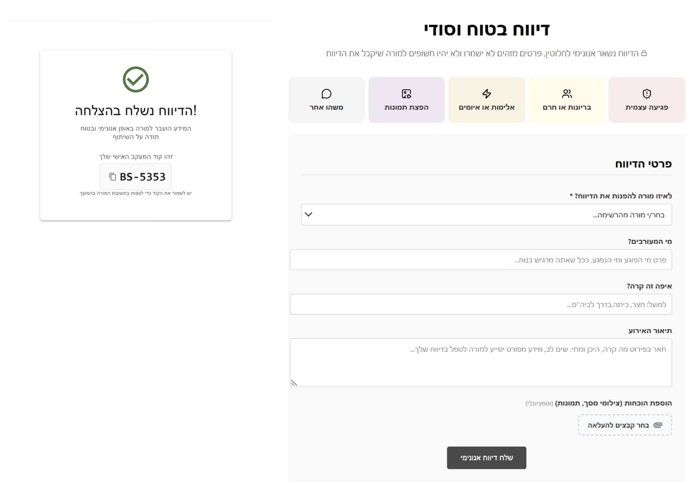
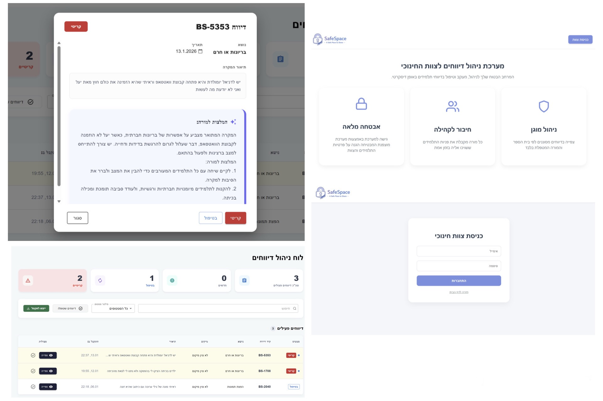

# SafeSpace - BeSafe Hackathon 2026 🏆 1st Place Winner

**SafeSpace** is a Fullstack web application designed as an anonymous platform for youth to report bullying, distress, and violence. Developed during the **BeSafe Hackathon** (by QueenB & Appsflyer), the project aims to provide a secure and private environment for students to seek help without fear of exposure.

---

## ✨ Key Features
* **Anonymous Reporting:** A simple, secure flow for students to report incidents.
* **AI-Powered Analysis (OpenAI API):** Real-time analysis of reports to categorize distress levels and filter out spam or irrelevant content.
* **Admin Dashboard:** A dedicated interface for educational staff to manage, track, and prioritize reports.
* **Secure Authentication:** Implementation of JWT for protected access to the admin area.

---

## 📸 Project Media

### Video Demos
Watch the system in action (click to open):
* [Student Reporting Demo](demo/Demo-student.mp4)
* [Teacher Management Demo](demo/Demo-Teacher.mp4)

### Screenshots

  
  

---

## 🛠️ Tech Stack
* **Frontend:** React, Vite, React Query (TanStack), Lucide-react (Icons).
* **Backend:** Node.js, Express.
* **Database:** MongoDB Atlas.
* **AI Integration:** OpenAI API.
* **Authentication:** JSON Web Tokens (JWT) & Bcrypt.

---

## ⚙️ Installation & Setup
To run SafeSpace locally, follow these steps:

### 1. Prerequisites
* **Node.js** (v18 or higher)
* **MongoDB Atlas** account
* **OpenAI API Key**

### 2. Getting Started
Clone the repository:
git clone [https://github.com/your-username/SafeSpace.git](https://github.com/your-username/SafeSpace.git)
cd SafeSpace

3. Server Setup
Navigate to the server folder: cd server

Install dependencies: npm install

Create a .env file based on .env.example and add your MONGO_URI, JWT_SECRET, and OPENAI_API_KEY.

Start the server: npm run dev

4. Client Setup
Open a new terminal and navigate to the client folder: cd client

Install dependencies: npm install

Create a .env file and add: VITE_SERVER_API_URL=http://localhost:5000/api

Start the frontend: npm run dev

⚠️ Note on AI Features: This project uses the OpenAI API for report analysis. If the API key is inactive, please refer to the Project Media section above to see the full AI flow in action in the demo videos.

###🚀 Impact & Recognition
Our team won 1st Place at the BeSafe Hackathon for this solution, recognized for its social impact, technical implementation, and user-centric design.
